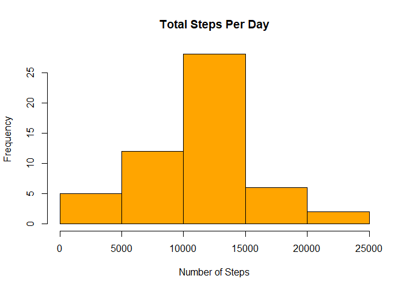
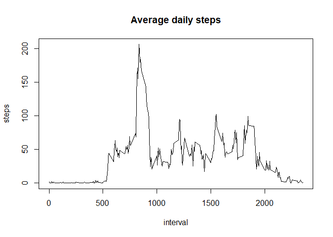
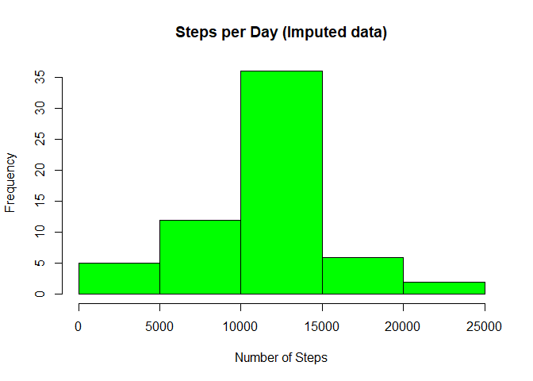
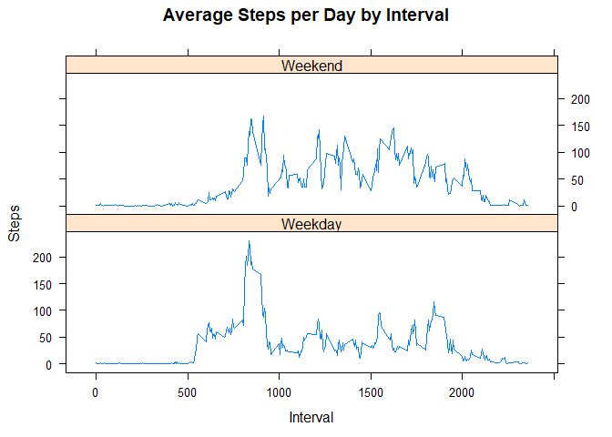

## Data

The variables included in this dataset are:

* **steps**: Number of steps taking in a 5-minute interval (missing
    values are coded as `NA`)

* **date**: The date on which the measurement was taken in YYYY-MM-DD
    format

* **interval**: Identifier for the 5-minute interval in which
    measurement was taken


The dataset(activity.csv) is stored in a comma-separated-value (CSV) file and there
are a total of 17,568 observations in this
dataset.

## Loading and preprocessing the data


```r
activitydata <- read.csv("activity.csv",header=TRUE)
```


## What is mean total number of steps taken per day?
1. An histogram indicating mean total number of steps taken per day

```r
steps_by_day <- aggregate(steps ~ date, activitydata, sum)
hist(steps_by_day$steps, main = paste("Total Steps Per Day"), col="orange", xlab="Number of Steps")
```

<!-- -->


2. The mean and median of the total number of steps per day


```r
rmean <- mean(steps_by_day$steps)
rmedian <- median(steps_by_day$steps)
```
The mean of total number of steps taken per day is 1.0766189\times 10^{4}
The median of total number of steps taken per day is 10765

## What is the average daily activity pattern?


1.A time series plot the Average Number Steps per Day by Interval

```r
steps_per_interval<-aggregate(steps~interval, data=activitydata, mean, na.rm=TRUE)
plot(steps~interval, data=steps_per_interval, type="l")
```

<!-- -->

2. Find Which interval, on average contains the maximum number of steps

```r
interval_max_steps <- steps_per_interval[which.max(steps_per_interval$steps),]$interval
```
The interval with maximum activity is interval 835


## Imputing missing values

Total number of missing values in the data

```r
NA_values <- sum(is.na(activitydata$steps))
```
Number of missing values : 2304

**The missing values in the dataset will be replaced by the mean number of steps across all days with the data available for that particular interval**

A new dataset with the missing values filled in

```r
steps_per_interval <- tapply(activitydata$steps, activitydata$interval, mean, na.rm = TRUE)
activity_split <- split(activitydata, activitydata$interval) #split the data by interval
for(i in 1:length(activity_split)){ #filling the values
    activity_split[[i]]$steps[is.na(activity_split[[i]]$steps)] <- steps_per_interval[i]
}
imputed_activity <- do.call("rbind", activity_split)
imputed_activity <- imputed_activity[order(imputed_activity$date) ,]
```
Histogram of the total number of steps taken each day after missing values are imputed and calculate and report the mean and median total number of steps taken per day


```r
StepsPerDay_imputed <- tapply(imputed_activity$steps, imputed_activity$date, sum)
hist(StepsPerDay_imputed, xlab = "Number of Steps",col="green", main = "Histogram: Steps per Day (Imputed data)")
```

<!-- -->


The new mean and median of the data

```r
mean_imputed <- mean(StepsPerDay_imputed, na.rm = TRUE)
median_imputed <- median(StepsPerDay_imputed, na.rm = TRUE)
```
The new mean of total number of steps taken per day is 1.0766189\times 10^{4}
The new median of total number of steps taken per day is 1.0766189\times 10^{4}

**Comparing with the previous mean and median, the mean remains the same, while the median value increased slightly**

## Are there differences in activity patterns between weekdays and weekends?
A plot to compare and contrast number of steps between the week and weekend. 


```r
weekdays <- c("Monday", "Tuesday", "Wednesday", "Thursday", 
              "Friday" )
imputed_activity$comp = as.factor(ifelse(is.element(weekdays(as.Date(imputed_activity$date)),weekdays), "Weekday", "Weekend"))
steps_by_interval_i <- aggregate(steps ~ interval + comp, imputed_activity, mean)
library(lattice)
xyplot(steps_by_interval_i$steps ~ steps_by_interval_i$interval|steps_by_interval_i$comp, main="Avg Steps per Day by Interval",xlab="Interval", ylab="Steps",layout=c(1,2), type="l") 
```

<!-- -->


**There is a higher peak earlier on weekdays, and more overall activity on weekends.**
